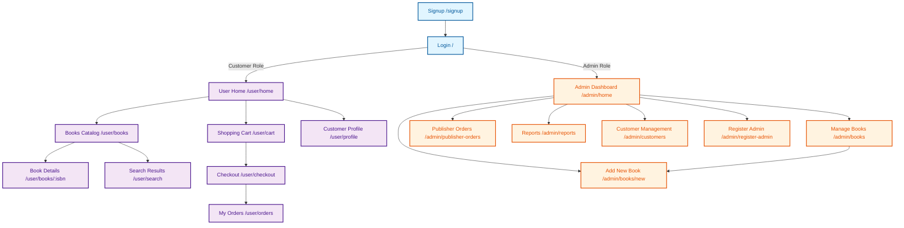

# User Interface Screen Logic Description

## Table of Contents
1. [Authentication Screens](#authentication-screens)
2. [User/Customer Screens](#usercustomer-screens)
3. [Admin Screens](#admin-screens)

---

## Authentication Screens

### 1. Login Page (`/`)
**File:** [frontend/app/page.tsx](../frontend/app/page.tsx)

**Purpose:** Main entry point for user authentication

**Logic Flow:**
1. **Initialization:**
   - On component mount, checks if user is already authenticated using `isAuthenticated()`
   - If authenticated, retrieves user information via `getCurrentUser()`
   - Automatically redirects authenticated users:
     - Customers → `/user/home`
     - Admins → `/admin/home`

2. **User Input Validation:**
   - Username and password fields are required
   - Shows error message if either field is empty
   - Password visibility can be toggled using eye icon

3. **Login Process:**
   - Sends POST request to `http://localhost:8080/api/auth/login`
   - Request body: `{ Login: username, Password: password }`
   - On successful authentication:
     - Stores JWT access token in `localStorage`
     - Retrieves user information from token
     - Redirects based on user role (Admin or Customer)
   
4. **Error Handling:**
   - Displays specific error messages for:
     - Invalid credentials
     - Server connection issues
     - Network errors
     - Invalid server responses
   - Loading state prevents duplicate submissions

5. **UI Features:**
   - Gradient background with BookStore branding
   - Show/hide password functionality
   - Loading spinner during authentication
   - Link to signup page for new users

---

### 2. Signup Page (`/signup`)
**File:** [frontend/app/(auth)/signup/page.tsx](../frontend/app/(auth)/signup/page.tsx)

**Purpose:** New customer account registration

**Logic Flow:**
1. **Initialization:**
   - Checks if user is already authenticated
   - Redirects authenticated users to `/user/home`

2. **Form Validation:**
   - Required fields: Username, Password, First Name, Last Name, Email, Address
   - Optional field: Phone
   - Password confirmation:
     - Checks that password and re-entered password match
     - Minimum password length: 6 characters
   - Displays validation errors before submission

3. **Registration Process:**
   - Sends POST request to `http://localhost:8080/api/auth/register`
   - Request body includes:
     ```json
     {
       "Username": string,
       "FirstName": string,
       "LastName": string,
       "Email": string,
       "Phone": string | null,
       "Address": string | null,
       "Password": string
     }
     ```
   - On successful registration:
     - Stores access token in `localStorage`
     - Stores user data in `localStorage`
     - Automatically redirects to `/user/home`

4. **Error Handling:**
   - Parses and displays backend validation errors
   - Shows server error messages
   - Prevents duplicate submissions with loading state

5. **UI Features:**
   - Two-column layout for form fields
   - Password strength indicator requirement (6+ characters)
   - Show/hide password toggles for both password fields
   - Visual icons for each input field type
   - Link back to login page

---

## User/Customer Screens

### 3. User Home Page (`/user/home`)
**File:** [frontend/app/user/home/page.tsx](../frontend/app/user/home/page.tsx)

**Purpose:** Customer dashboard and landing page after login

**Logic Flow:**
1. **Authentication & Authorization:**
   - Verifies user is authenticated
   - Ensures user role is "Customer"
   - Redirects non-authenticated or non-customer users to login

2. **Data Loading:**
   - **Cart Data:** Fetches current cart to display item count
     - Calculates total items from cart quantities
     - Updates cart badge in navigation
   - **Book Preview:** Loads first 12 unique books for display
     - Removes duplicate books by ISBN
     - Shows featured books for quick browsing

3. **Quick Access Cards:**
   - **Shopping Cart Card:**
     - Displays current cart count
     - Shows dynamic message based on cart state
     - Primary button if cart has items, outline if empty
   - **My Orders Card:**
     - Links to order history
     - Static description of order tracking
   - **Customer Profile Card:**
     - Links to profile management
     - Shows profile editing capability

4. **Book Gallery:**
   - Displays 12 books in responsive grid (1-4 columns based on screen size)
   - Uses `BookCard` component for each book
   - "View All Books" button to browse complete catalog
   - Refresh cart count when items are added

5. **Loading States:**
   - Shows loading message while fetching user and cart data
   - Prevents rendering until authentication is verified

---

### 4. Books Catalog Page (`/user/books`)
**File:** [frontend/app/user/books/page.tsx](../frontend/app/user/books/page.tsx)

**Purpose:** Browse and filter all available books

**Logic Flow:**
1. **Authentication Check:**
   - Verifies Customer role
   - Redirects if not authorized

2. **URL Parameter Handling:**
   - Reads `category` query parameter from URL
   - Reads `q` (search query) parameter
   - Updates filter state based on URL parameters

3. **Book Loading:**
   - Fetches all books from API
   - Removes duplicate ISBNs
   - Stores complete book list for client-side filtering

4. **Multi-level Filtering System:**
   - **Category Filter:** 
     - From URL parameter (e.g., `/user/books?category=fiction`)
     - From filter dropdown
   - **Search Query:** Searches across:
     - Book title
     - Author names
     - Category
     - ISBN
   - **Author Filter:** Exact match on author name
   - **Price Range:**
     - Minimum price threshold
     - Maximum price threshold

5. **Filter Application:**
   - Filters are applied sequentially and cumulatively
   - All filters work together (AND logic)
   - Real-time filtering without API calls
   - Updates result count dynamically

6. **UI Components:**
   - Search bar for text queries
   - Filter dropdowns for category, author, and price
   - "View All Books" button when category filter is active
   - Result count display
   - Responsive grid layout (1-4 columns)
   - Loading skeleton during data fetch
   - Empty state when no results match filters

7. **Integration:**
   - Uses `SearchBar` component for search functionality
   - Uses `SearchFilters` component for advanced filtering
   - Uses `BookCard` component for each book display

---

### 5. Search Results Page (`/user/search`)
**File:** [frontend/app/user/search/page.tsx](../frontend/app/user/search/page.tsx)

**Purpose:** Display search results from header search bar

**Logic Flow:**
1. **Query Parameter Processing:**
   - Reads `q` parameter from URL
   - Displays the search term to the user

2. **Search Implementation:**
   - Loads all books once
   - Performs client-side search across:
     - Title (case-insensitive, partial match)
     - Authors (case-insensitive, partial match)
     - Category (case-insensitive, partial match)
     - ISBN (case-insensitive, partial match)

3. **Combined Filtering:**
   - Search query filter (primary)
   - Additional filters:
     - Category dropdown
     - Author dropdown
     - Price range (min/max)
   - All filters work together

4. **Search Flow:**
   - User enters query in header search bar
   - Redirected to `/user/search?q=<query>`
   - Results filtered and displayed
   - Can refine results using additional filters

5. **Result Display:**
   - Shows count of matching results
   - Displays search term in results message
   - Grid layout of matching books
   - Empty state if no results:
     - Shows "No Results Found" message
     - Displays search term
     - Button to browse all books

6. **Suspense Boundary:**
   - Wraps search content in Suspense component
   - Shows loading fallback during search parameter parsing

---

### 6. Book Details Page (`/user/books/[isbn]`)
**File:** [frontend/app/user/books/[isbn]/page.tsx](../frontend/app/user/books/[isbn]/page.tsx)

**Purpose:** Display detailed information about a specific book

**Logic Flow:**
1. **ISBN Parameter:**
   - Extracts ISBN from URL path parameter
   - Uses ISBN to fetch specific book data

2. **Book Data Loading:**
   - Fetches book details using `booksApi.getByIsbn(isbn)`
   - Loads book cover image from external API
   - Handles image loading errors with fallback icon

3. **Stock Availability:**
   - Checks if book is in stock (`stock > 0`)
   - Shows different states:
     - Out of Stock: Displays red badge, disables add to cart
     - Low Stock (< 10): Shows yellow warning badge
     - In Stock: Shows normal purchasing interface

4. **Add to Cart Functionality:**
   - Quantity selector (only if in stock)
   - Default quantity: 1
   - Add to Cart button:
     - Sends request with ISBN and quantity
     - Shows loading state during API call
     - Shows success checkmark for 2 seconds
     - Prevents duplicate clicks when added
   - Error handling for failed additions

5. **Book Information Display:**
   - Large book cover (or placeholder icon)
   - Title and authors
   - Price (large, prominent display)
   - ISBN
   - Category
   - Publication year (if available)
   - Stock quantity

6. **Navigation:**
   - Back to Books button returns to catalog
   - Breadcrumb-style navigation

7. **Error States:**
   - Book Not Found: Shows message with back button
   - Image Error: Falls back to book icon placeholder
   - Loading: Shows loading message

---

### 7. Shopping Cart Page (`/user/cart`)
**File:** [frontend/app/user/cart/page.tsx](../frontend/app/user/cart/page.tsx)

**Purpose:** Review and manage cart contents before checkout

**Logic Flow:**
1. **Cart Data Loading:**
   - Fetches cart items with full details
   - Each cart item includes:
     - ISBN, title
     - Price per unit
     - Quantity
     - Total price (quantity × price)

2. **Quantity Management:**
   - **Increase/Decrease Buttons:**
     - Plus button: Increments quantity by 1
     - Minus button: Decrements quantity by 1
   - **Update Process:**
     - Removes item from cart
     - Re-adds with new quantity
     - Validates against stock availability
     - Shows loading state during update
   - **Minimum Quantity:**
     - If quantity reaches 0, item is removed

3. **Item Removal:**
   - Trash icon button on each item
   - Shows loading state on specific item being removed
   - Calls `cartApi.removeItem(isbn)`
   - Refreshes cart after removal

4. **Price Calculations:**
   - **Per-Item Total:** quantity × unit price
   - **Cart Subtotal:** Sum of all item totals
   - Both displayed in real-time

5. **Checkout Process:**
   - "Proceed to Checkout" button:
     - Only enabled if cart has items
     - Navigates to `/user/checkout`
   - Displays total price prominently

6. **Empty Cart State:**
   - Shows shopping cart icon
   - "Your cart is empty" message
   - Button to browse books

7. **UI Features:**
   - Book cover thumbnails (with fallback)
   - ISBN display
   - Quantity controls with +/- buttons
   - Individual item removal
   - Price breakdown (unit price vs. total)
   - Back to Home navigation
   - Responsive layout

8. **Error Handling:**
   - API errors shown in alerts
   - Failed updates preserve previous state
   - Network error handling

---

### 8. Checkout Page (`/user/checkout`)
**File:** [frontend/app/user/checkout/page.tsx](../frontend/app/user/checkout/page.tsx)

**Purpose:** Complete purchase with payment information

**Logic Flow:**
1. **Initial Data Loading:**
   - Loads cart items (for order summary)
   - Loads saved credit cards
   - Validates cart is not empty
   - Pre-selects a valid credit card

2. **Credit Card Management:**
   - **Display Saved Cards:**
     - Shows all saved credit cards
     - Displays last 4 digits only
     - Shows expiration date
     - Marks expired cards
     - Disables selection of expired cards
   
   - **Add New Card:**
     - Toggle "Add New Card" form
     - Fields:
       - Card number (16 digits, formatted with spaces)
       - Cardholder name
       - Expiration date (MM/YY format)
     - Validation:
       - All fields required
       - Expiration date format validation
       - Auto-formatting of inputs
     - Saves card and auto-selects it
   
   - **Card Selection:**
     - Radio button group for card selection
     - Highlights selected card
     - Only one card can be selected

3. **Order Summary Display:**
   - Lists all cart items with:
     - Book cover thumbnails
     - Title and ISBN
     - Quantity and unit price
     - Item total
   - Shows total items count
   - Shows order total (sum of all items)

4. **Checkout Process:**
   - **Validation:**
     - Ensures card is selected
     - Ensures cart is not empty
     - Checks that selected card is not expired
   
   - **Order Submission:**
     - Sends POST request with `cardId`
     - Shows processing state (button disabled)
     - Handles API response
   
   - **Success Flow:**
     - Shows success message with checkmark
     - Displays confirmation
     - Auto-redirects to `/user/orders` after 2 seconds
     - Provides manual link to orders page

5. **Error Handling:**
   - Empty cart: Shows message and prevents checkout
   - No credit cards: Prompts to add one
   - Invalid card data: Shows validation errors
   - Failed checkout: Displays error message
   - Network errors: User-friendly messages

6. **Input Formatting:**
   - Card number: Auto-formats with spaces (1234 5678 9012 3456)
   - Expiration date: Auto-formats with slash (MM/YY)
   - Removes non-digit characters

7. **Loading States:**
   - Initial page load
   - Adding credit card
   - Processing checkout
   - Individual card actions

---

### 9. My Orders Page (`/user/orders`)
**File:** [frontend/app/user/orders/page.tsx](../frontend/app/user/orders/page.tsx)

**Purpose:** View order history and order details

**Logic Flow:**
1. **Order Data Loading:**
   - Fetches all orders for the current user
   - Orders include nested order items (books purchased)
   - Sorted by order date (most recent first)

2. **Order List Display:**
   - Each order shows:
     - Shortened Order ID (first 8 characters, uppercase)
     - Order date (formatted: "Month Day, Year")
     - Total price
     - Expand/collapse button

3. **Order Details (Expandable):**
   - **Toggle Mechanism:**
     - Click "View Details" to expand
     - Click "Hide Details" to collapse
     - One order expanded at a time
   
   - **Order Information Section:**
     - Full Order ID (UUID)
     - Complete order date and time
     - Total price
     - Total number of items
   
   - **Order Items Section:**
     - Each book in the order displays:
       - Book cover thumbnail
       - Title and ISBN
       - Unit price at time of purchase
       - Quantity ordered
       - Subtotal for that item
     - Grid layout for items
     - Total price calculation

4. **Date Formatting:**
   - Order card: "Month Day, Year" format
   - Details view: "Month Day, Year at HH:MM AM/PM"

5. **Empty State:**
   - Shows package icon
   - "No orders yet" message
   - Encourages browsing books
   - Link to book catalog

6. **UI Features:**
   - Collapsible order cards
   - Icon indicators (Package, Calendar, Dollar Sign)
   - Organized information sections
   - Responsive grid for order items
   - Back to Home navigation

7. **Loading State:**
   - Shows spinner while loading orders
   - Loading message displayed

---

### 10. Customer Profile Page (`/user/profile`)
**File:** [frontend/app/user/profile/page.tsx](../frontend/app/user/profile/page.tsx)

**Purpose:** Manage personal information and saved credit cards

**Logic Flow:**
1. **Profile Data Loading:**
   - Fetches user profile using username
   - Loads saved credit cards
   - Pre-populates form with current data

2. **Profile Information Management:**
   - **Editable Fields:**
     - First Name (required)
     - Last Name (required)
     - Email (required)
     - Phone (optional)
     - Address (optional)
   
   - **Update Process:**
     - User modifies fields
     - Clicks "Save Changes"
     - Sends PUT request to update profile
     - Shows success message on completion
     - Handles validation errors

3. **Credit Card Management:**
   - **View Saved Cards:**
     - Displays all saved cards
     - Shows last 4 digits (masked)
     - Shows expiration date
     - Indicates expired status
   
   - **Add New Card:**
     - Expandable form section
     - Fields: Card number, cardholder name, expiration
     - Same validation as checkout page
     - Auto-formatting of inputs
     - Success message after addition
   
   - **Delete Card:**
     - Trash icon on each card
     - Confirmation dialog before deletion
     - Removes card from account
     - Refreshes card list

4. **Password Management:**
   - **Change Password Section:**
     - Current password (required)
     - New password (required, min 6 chars)
     - Confirm new password (must match)
     - Separate form from profile updates
     - Show/hide password toggles
   
   - **Password Update Process:**
     - Validates all fields filled
     - Checks new passwords match
     - Checks minimum length
     - Sends password change request
     - Shows success/error message

5. **Validation:**
   - Profile: Required fields validation
   - Credit Card: Format and expiration validation
   - Password: Match and length validation

6. **Success/Error Messages:**
   - Profile save success
   - Password change success
   - Card addition success
   - Various error states for each action

7. **UI Organization:**
   - Tabbed or sectioned layout
   - Profile information section
   - Credit cards section
   - Password change section
   - Clear separation of concerns

8. **Loading States:**
   - Profile loading
   - Saving profile changes
   - Adding/deleting cards
   - Changing password

---

## Admin Screens

### 11. Admin Dashboard (`/admin/home`)
**File:** [frontend/app/admin/home/page.tsx](../frontend/app/admin/home/page.tsx)

**Purpose:** Central hub for admin operations

**Logic Flow:**
1. **Authentication & Authorization:**
   - Verifies user is authenticated
   - **Role Check:** Ensures user role is "Admin"
   - Redirects non-admin users to login page

2. **Admin Quick Access Cards:**
   - **Manage Books:**
     - Links to book management interface (likely `/admin/books`)
     - Description: View, edit, and update stock
     - Primary action button
   
   - **Add New Book:**
     - Links to book creation form (likely `/admin/books/new`)
     - Description: Add book with ISBN, title, authors, details
     - Outline button (secondary action)
   
   - **Publisher Orders:**
     - Links to replenishment orders (likely `/admin/publisher-orders`)
     - Description: View and confirm auto-generated orders
     - Manages inventory replenishment
   
   - **Reports:**
     - Links to reporting interface (likely `/admin/reports`)
     - Description: Sales reports, top customers, best-selling books
     - Analytics and business intelligence

3. **Welcome Message:**
   - Displays admin username
   - Shows admin-specific greeting
   - Explains dashboard purpose

4. **Layout:**
   - Responsive grid (1-3 columns based on screen size)
   - Card-based navigation
   - Icon indicators for each section
   - Hover effects for interactivity

5. **Loading State:**
   - Verifies authentication before rendering
   - Shows loading message during verification

---

### 12. Manage Books Page (`/admin/books`)
**File:** [frontend/app/admin/books/page.tsx](../frontend/app/admin/books/page.tsx)

**Purpose:** Admin interface for managing book inventory and details

**Logic Flow:**
1. **Authentication & Authorization:**
   - Verifies user is authenticated with Admin role
   - Redirects non-admin users to login

2. **Data Loading:**
   - Fetches all books with complete details
   - Loads all authors for author assignment
   - Removes duplicate ISBNs from display

3. **Search & Filter:**
   - Real-time search across book title, ISBN, author names, and category
   - Client-side filtering for immediate results
   - Search bar with magnifying glass icon

4. **Book Management Operations:**
   - **Edit Book:**
     - Inline editing with expandable form
     - Editable fields: title, publisher ID, publication year, price, category, stock, threshold
     - Author assignment with multi-select checkboxes
     - Real-time validation
     - Save/Cancel buttons with loading states
   
   - **Delete Book:**
     - Trash icon with confirmation dialog
     - Shows loading state during deletion
     - Removes book from inventory entirely

5. **Book Display:**
   - Tabular layout with book cover thumbnails
   - Shows ISBN, title, authors, price, stock, category
   - Stock level indicators (low stock warnings)
   - Publication year and threshold information

6. **Navigation:**
   - "Add New Book" button linking to creation form
   - Back to Admin Dashboard
   - Breadcrumb navigation

7. **Error & Success Handling:**
   - Success messages for updates and deletions
   - Error handling for failed operations
   - Form validation feedback

---

### 13. Add New Book Page (`/admin/books/new`)
**File:** [frontend/app/admin/books/new/page.tsx](../frontend/app/admin/books/new/page.tsx)

**Purpose:** Create new books in the inventory system

**Logic Flow:**
1. **Authentication Check:**
   - Verifies Admin role access

2. **Form Fields:**
   - ISBN (required, unique identifier)
   - Title (required)
   - Publisher selection from available publishers
   - Publication year
   - Price (required, numeric validation)
   - Category
   - Initial stock quantity
   - Stock threshold for reordering
   - Author assignment (multi-select)

3. **Author Management:**
   - Load all available authors
   - Multi-select checkbox interface
   - Create new authors if needed

4. **Validation:**
   - Required field validation
   - ISBN format and uniqueness checking
   - Price and stock numeric validation
   - Author selection requirement

5. **Creation Process:**
   - Validates all form data
   - Submits book creation request
   - Handles success/error responses
   - Redirects to book management on success

---

### 14. Publisher Orders Page (`/admin/publisher-orders`)
**File:** [frontend/app/admin/publisher-orders/page.tsx](../frontend/app/admin/publisher-orders/page.tsx)

**Purpose:** Manage replenishment orders for low-stock books

**Logic Flow:**
1. **Order Data Loading:**
   - Fetches all pending replenishment orders
   - Loads book details for each order
   - Combines order data with book information

2. **Order Display:**
   - Shows order ID, book details, current stock
   - Displays order quantity and urgency indicators
   - Book cover thumbnails with order information

3. **Order Management:**
   - **Confirm Order:**
     - Button to confirm replenishment order
     - Updates stock levels automatically
     - Marks order as completed
     - Shows confirmation loading state
   
   - **Order Status:**
     - Pending orders highlighted
     - Completed orders marked with checkmarks
     - Time-based priority indicators

4. **Book Information:**
   - Shows current stock vs. threshold levels
   - Displays book title, ISBN, category
   - Indicates critical stock levels

5. **Automated System:**
   - Orders automatically generated when stock falls below threshold
   - Admin confirmation required before processing
   - Integrates with inventory management system

---

### 15. Reports Page (`/admin/reports`)
**File:** [frontend/app/admin/reports/page.tsx](../frontend/app/admin/reports/page.tsx)

**Purpose:** Business intelligence and analytics dashboard

**Logic Flow:**
1. **Report Categories:**
   - **Sales Reports:**
     - Previous month total sales
     - Sales by specific date
     - Date range analysis
   
   - **Top Customers:**
     - Customers by total purchase amount
     - Customer ranking and statistics
     - Purchase history insights
   
   - **Best-Selling Books:**
     - Books by total sales volume
     - Revenue by book category
     - Inventory performance metrics

2. **Sales Analytics:**
   - **Previous Month Sales:**
     - Automatic calculation of previous month revenue
     - Comparison metrics and trends
   
   - **Date-Specific Sales:**
     - Date picker for specific day analysis
     - Real-time sales data fetching
     - Daily performance metrics

3. **Customer Analytics:**
   - Top customer identification by spend
   - Customer loyalty metrics
   - Purchase pattern analysis

4. **Book Performance:**
   - Best-selling books ranking
   - Revenue contribution by title
   - Stock turnover analysis

5. **Visual Representation:**
   - Card-based layout for each report type
   - Statistical indicators and trends
   - Color-coded performance metrics

6. **Interactive Features:**
   - Date selection for custom reports
   - Real-time data updates
   - Export capabilities for business analysis

---

### 16. Customer Management Page (`/admin/customers`)
**File:** [frontend/app/admin/customers/page.tsx](../frontend/app/admin/customers/page.tsx)

**Purpose:** Admin interface for managing customer accounts

**Logic Flow:**
1. **Customer Data Loading:**
   - Fetches all registered customers
   - Displays customer profiles and account information

2. **Customer Information Display:**
   - Customer details (name, email, registration date)
   - Order history summary
   - Account status and activity

3. **Customer Management:**
   - View detailed customer profiles
   - Monitor customer activity and purchases
   - Account management capabilities

---

### 17. Admin Registration Page (`/admin/register-admin`)
**File:** [frontend/app/admin/register-admin/page.tsx](../frontend/app/admin/register-admin/page.tsx)

**Purpose:** Create new administrator accounts

**Logic Flow:**
1. **Registration Form:**
   - Admin-specific account creation
   - Required fields for admin users
   - Role assignment and permissions

2. **Validation:**
   - Admin credential validation
   - Security requirements for admin accounts
   - Authorization checks

3. **Account Creation:**
   - Creates new admin user accounts
   - Assigns appropriate admin permissions
   - Integrates with authentication system

---

## Common UI Components

### SearchBar Component
**Purpose:** Global search functionality across the application

**Logic:**
- Accepts search query input
- Redirects to `/user/search?q=<query>` on submission
- Real-time search capability
- Integrated in header and search pages

### SearchFilters Component
**Purpose:** Advanced filtering options for book browsing

**Features:**
- Category dropdown (populated from available books)
- Author dropdown (populated from available books)
- Price range inputs (min and max)
- Applies filters via callback to parent component

### BookCard Component
**Purpose:** Reusable book display with add-to-cart functionality

**Features:**
- Book cover image with fallback
- Title, authors, price, category
- Stock availability indicator
- Add to Cart button
- Click to view details
- Real-time stock status

### Header Component
**Purpose:** Global navigation bar

**Features:**
- Logo and site branding
- Search bar (for customers)
- Navigation links based on user role
- Cart icon with item count (for customers)
- User menu with logout option

### AuthGuard Component
**Purpose:** Protect routes from unauthorized access

**Features:**
- Checks authentication status
- Validates user role
- Redirects unauthorized users
- Used in layout components

---

## Authentication & State Management

### Authentication System
**Location:** [frontend/lib/auth.ts](../frontend/lib/auth.ts)

**Functions:**
- `isAuthenticated()`: Checks if JWT token exists
- `getCurrentUser()`: Decodes JWT and returns user info
- Token stored in `localStorage`
- Automatic token validation
- Role-based routing

### API Integration
**Location:** [frontend/lib/api.ts](../frontend/lib/api.ts)

**Features:**
- Centralized API request handling
- Automatic token inclusion in headers
- Type-safe API calls with TypeScript
- Error handling and response parsing
- Endpoints for:
  - Books (getAll, getByIsbn, create, update, delete)
  - Cart (getCart, addItem, removeItem, checkout)
  - Orders (getAll)
  - Credit Cards (getAll, addCard, deleteCard)
  - Users (profile management, getAllCustomers)
  - Authors (getAll, create, update)
  - Publishers (getAll)
  - Reports (totalSales, topCustomers, topBooks)
  - Replenishment Orders (getAll, confirm)

---

## Screen Flow Diagram



---

## Key Design Patterns

### 1. Route Protection
- All pages check authentication status on mount
- Role-based redirects (Customer vs Admin)
- Consistent authentication flow

### 2. Data Loading Pattern
```
useEffect(() => {
  1. Check authentication
  2. Verify user role
  3. Load required data
  4. Handle errors
  5. Set loading state to false
}, [router])
```

### 3. Error Handling
- User-friendly error messages
- Network error detection
- Validation before API calls
- Graceful fallbacks

### 4. Loading States
- Skeleton screens for data loading
- Disabled buttons during processing
- Loading spinners for async operations
- Prevents duplicate submissions

### 5. Optimistic UI Updates
- Immediate feedback on user actions
- Success indicators (checkmarks)
- Temporary state changes before API confirmation

---

## Summary

This Order Processing System implements a comprehensive e-commerce interface with distinct user experiences for customers and administrators. The application follows modern React patterns with:

- **Client-side routing** using Next.js App Router
- **Role-based access control** with JWT authentication
- **Responsive design** with mobile-first approach
- **Real-time filtering** without unnecessary API calls
- **Consistent UX patterns** across all screens
- **Comprehensive error handling** for better user experience
- **Type safety** with TypeScript throughout

The customer journey flows naturally from browsing to purchasing, while admin screens provide comprehensive management capabilities including:

- **Complete Book Management:** CRUD operations for books with real-time stock tracking
- **Inventory Control:** Automated replenishment orders with admin confirmation workflow
- **Business Analytics:** Comprehensive reports for sales, customers, and book performance
- **Customer Oversight:** Customer account management and activity monitoring
- **Admin User Management:** Secure admin account creation and role management

All screens maintain consistent authentication checks, loading states, and error handling patterns with role-based access control ensuring proper security boundaries.
